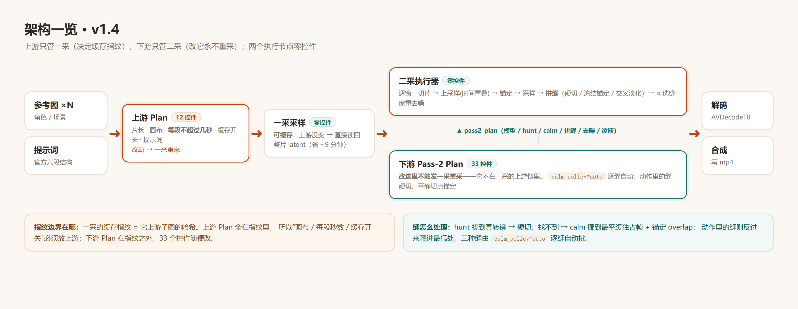

# comfyui-h3-seamkit

**把 MiniMax H3 分块二采的「接缝」，变成一次有意识的剪辑。**

> `seam` = 接缝，`kit` = 工具箱。硬切（把缝变成剪辑点）只是其中一种策略——缝还看得见时，
> 还有冻结锚定 / 交叉淡化 / 缝窗重去噪一整套处置办法。
> 依赖上游 [comfyui-minimax-h3-audio-T8](https://github.com/T8mars/comfyui-minimax-h3-audio-T8)（GPL-3.0-or-later），运行时调用它的放大器 / 采样 / 条件重锚。
> **许可：GPL-3.0-or-later**（与上游一致）。除 ComfyUI 与 torch 外无额外 pip 依赖。

---

## 它解决什么

分块二采把长片切成窗口各自采样，段与段的 overlap 混合会产生**重影 / 发糊**。
本插件的思路：

1. 每窗独立采样，**overlap 处冻结上一窗的输出**（逐字复制，零重影）；
2. 提示词在切点要求模型换镜头 → 接缝成为**合法的剪辑语法**；
3. hunt / calm 自动决定每条缝**硬切还是锚定**；
4. 副作用是好的：每段更短，**峰值显存更低**——RTX 4060 Laptop 8GB 可以跑 15 秒 / 1.5MP。

## 架构（v1.4）



- **上游 Plan**：画布、每段秒数、缓存开关、提示词——只留**影响一采**的东西
- **下游 Pass-2 Plan**：模型三件套、hunt/calm、锚定、拼缝、重去噪、诊断——全部二采参数
- **`calm_policy=auto`（默认）**：逐缝看邻域闹度——动作里的缝硬切藏进混乱，
  动作结束后的平静切点自动改走锚定 overlap。同一条片两种缝各走各的。
- 两个执行节点**零控件**；提示词识别只认**行首 `[Shot N] At + 时间点`**（任意浮点精度）。

## 安装

1. 克隆到 `ComfyUI/custom_nodes/`：
   ```bash
   git clone https://github.com/yanghuagai55/comfyui-h3-seamkit.git
   ```
2. 重启 ComfyUI。节点在分类 **`MiniMax H3 Hard Cut`** 下（10 个）。
3. 上游依赖同装：`comfyui-minimax-h3-audio-T8`。

### ⚠ 内存/显存报错？用 `tools/pinned_memory_patch.py`

8GB 卡 + 32GB 内存跑二采，若报 **`hostbuf_grow` / `aimdo memory compile error` /
pinned memory / CUDA OOM** 一类错误，**先用这个工具**再排查别的：

```bash
D:\comfyui\comfyenv\python.exe tools\pinned_memory_patch.py
```

交互菜单一键切换预设（推荐 **3) 新设置（稳定跑通）**：A=0.45 + B=16GiB + `--disable-async-offload`）。
它修改 `comfy/model_management.py` 的 pinned 上限与启动 bat（自动备份，可一键复原），
**改完必须重启 ComfyUI**。

## 快速上手（三步）

1. 搭最小链路（照 `examples/` 里的现成工作流）：
   `上游 Plan → 条件节点 → 一采 #93 → 二采 #40 → 解码`，`下游 Pass-2 Plan → #40`。
2. 写提示词：照 [`templates/prompt-template.md`](templates/prompt-template.md)
   （官方六段骨架 + 4 条注意事项：时间戳任意浮点、禁一镜到底措辞、**blocking 写死**、
   `[Shot N] At` 只在行首用作声明）。
3. 排队。切点时间以**上游报告的 `cut points`** 为准；校验器只警告不拦停
   （时间戳是指示值，overlap 模式由锚定吸收偏差）。

参数细节与原理：[`docs/GUIDE.md`](docs/GUIDE.md)
（第一章工作原理带线框图；第二章按组讲每个控件：画布 / 切点 / 缓存 / 提示词 / 采样 /
模型 / hunt / calm / 锚定 / 拼缝 / 重去噪 / 诊断）。

## v1.4 亮点

- **上下游拆分完成**：执行节点零控件；一采指纹只含上游 12 控件——下游 33 个控件随便改不重采
- **`calm_policy=auto`**：逐缝自动选 jerk 硬切（剧烈）/ calm 锚定（平静），一条片两种缝各走各的
- **提示词识别放宽**：时间戳任意浮点；`[Shot N]` 只认行首声明，句中引用自动警告
- **`upscale_pad_tokens=3` 默认**：治分块尾软化
- 文档全新：`docs/GUIDE.md`（原理 + 参数）+ 单页提示词模板

## 附带工具（`tools/`）

| 工具 | 用途 |
|---|---|
| `pinned_memory_patch.py` | 内存/pinned 上限补丁（**报错先用它**，交互菜单） |
| `seam_report.py` | 逐缝台阶 / 闪烁测量（单机自检 + A/B 对照） |
| `check_cut_flicker.py` | 成片缝与闪屏取证 |
| `repair_seam.py` | 像素域接缝修复 |
| `analyze_cut.py` | 真实切点分析与接触表 |
| `latent_cache.py` | 一采 latent 缓存管理（ComfyUI 之外用） |
| `check_widgets.py` | 控件槽位体检（UI 错位排查） |
| `attention_backend_patch.py` | 注意力后端补丁（A/B 可复现） |

纯计算器（不起 ComfyUI）：`hardcut_math.py`。

## 致谢与来源

### 上游依赖（运行时直接调用它的代码）

- **[comfyui-minimax-h3-audio-T8](https://github.com/T8mars/comfyui-minimax-h3-audio-T8)**（作者 **T8mars**，GPL-3.0-or-later）——
  二采执行器在运行时直接调用它的**放大器 / DualClock 采样 / 条件重锚 / 分段装配
  （`_append_video_guarded_overlap`）**，plan 契约与它保持逐字段兼容。本插件建立在它的基础上。
  许可证选 GPL-3.0-or-later 也是因为它：与 GPL 代码链接的衍生作品必须同许可。

### 官方素材

- **MiniMax H3** 的模型与官方提示词规范（六段式 R2V 模板）——`templates/prompt-template.md`
  按官方结构编写，只追加了硬切路线的注意事项。

### 思路来源（**仅借鉴思想，未搬运任何代码**）

| 来源 | 用在哪 | 说明 |
|---|---|---|
| **MAINodes · H3 Jerk Oracle**（matlowai） | jerk（三阶差分）剖面指标、`calm_abstain_below`「平淡时放弃搜索」 | GPL-3.0-or-later（与本包同许可）；按思路重新实现 |
| **PERSIST**（arXiv:2608.29287） | hunt 的「持续性」判据——真转镜留在另一个稳态，闪烁会回落 | 论文思路，手写窗口均值实现 |
| **RePaint**（Lugmayr et al., CVPR 2022, arXiv:2201.09865） | 缝窗重去噪：每一步都把已知区重注入 | **仅思路**——RePaint 仓库是 CC BY-NC-SA 4.0，与本包 GPL 不兼容，故**一行代码未用**；实际执行该机制的是 ComfyUI 核心自带的 `KSamplerX0Inpaint` |
| **StreamingT2V** | 多 token 锚定（`anchor_tokens`）——单帧条件才是分段不一致的根源 | 论文思路 |
| **ComfyUI 核心** | `KSamplerX0Inpaint` / `scale_latent_inpaint`（锁端每步重注入的实际实现者） | GPL-3.0 |

### 协作与审计

- **Zhipu AI（GLM）**：缝窗重去噪（route ①）的首版实现与配套单测（提交 `e9ee3c0`），
  以及 token 变化检测方法的四轮文献调研。
- **外部对抗性审计**：第三方审阅者对本插件的检测栈与策略树做过逐条核查，
  未通过的缺陷（D1–D3 等）均已修复——相关结论记录在提交历史中。

### 实测环境

全部效果数字来自本机 **RTX 4060 Laptop 8GB / 32GB RAM** 上的实测；
`docs/GUIDE.md` 中标注的阈值与经验线（负载线 180/191、`calm_min_gain` 0.15 等）均为实测值。

## 许可

GPL-3.0-or-later（与上游 T8 包一致）。
