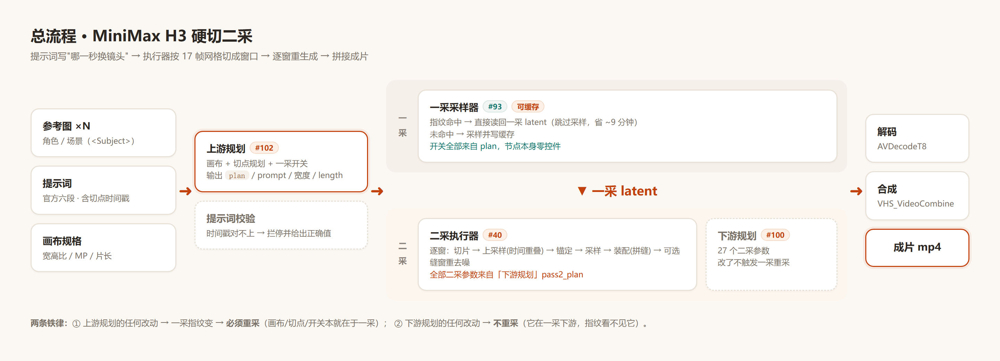
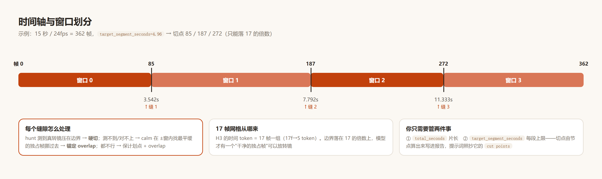
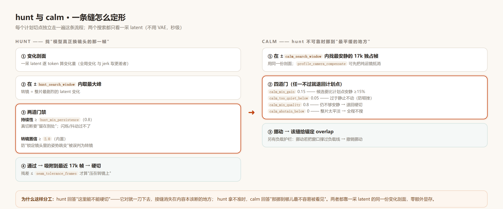

# 使用说明书 · comfyui-h3-seamkit

> 面向使用者的完整说明。README 讲"是什么/怎么装"，本文件讲**为什么这样跑**与**每个参数怎么用**。
> 版本：2026-09-26（上下游节点拆分版）

---

# 第一章 · 工作原理

## 1.1 总流程（一张图）



<sub>总流程：输入 → 上游规划 → 一采(缓存) → 二采执行器 → 解码合成</sub>

**核心思想**：提示词里写"哪一秒换镜头"，执行器按 **17 帧网格**把整片切成几个窗口，
**逐窗重新生成**再拼起来。窗口边界落在哪里、拼缝怎么处理，全部由两个规划节点控制。

```text
   时间轴（15s / 24fps = 362 帧）
   0        85       187       272      362
   ├────────┼─────────┼─────────┼────────┤
    窗口 0    窗口 1     窗口 2    窗口 3        ← 边界只能落 17 的倍数
              ↑         ↑         ↑
           硬切/锚定、calm 可挪、hunt 可移
```

## 1.2 各部分怎么实现的

### ① 一采（#93）与缓存



<sub>时间轴与窗口划分：15s → 4 个窗口，边界只能落 17 的倍数</sub>

- **指纹** = 从 #93 的**全部输入**反向上游，逐节点哈希（类名 + 字面量 + 连线）的 sha256
- 因为上游规划节点的 plan 会改写条件节点里的提示词时间戳，**规划节点的每个控件都在指纹里** →
  所以"一采开关"和"画布/切点"放上游（改它们本来就该重采），**二采参数全部搬去了下游节点**
  （改它们不触发重采）

### ② 二采执行器（#40）逐窗做什么


<sub>二采执行器逐窗六步：切片 → 上采样 → 锚定 → 采样 → 装配 → 可选去噪</sub>

### ③ 拼缝：hard cut / anchor overlap / blend


<sub>拼缝三态：硬切 / 冻结锚定 / 交叉淡化</sub>

| 缝类型 | 何时 | 观感 |
|---|---|---|
| **硬切** | hunt 测到的转镜正好压在边界（残差 ≤ `seam_tolerance_frames`） | 内容本来就该断 → 看不出 |
| **锚定 overlap** | hunt 拒绝 / 网格推离 / calm 挪过界 | 静态镜头不可见；运动内容轻度软化 |

### ④ hunt：找"模型真正换镜头的那一帧"



<sub>hunt 与 calm：一条缝怎么定形（流程 + 门禁）</sub>

### ⑤ calm：hunt 不可靠时"挪到最平缓的地方"

```text
   在 计划切点 ± calm_search_window 内，找 global/jerk 最安静的 17k 独占帧
        │
        ▼
   4 道门：
     calm_min_gain(0.15)     候选必须比计划点安静 ≥15%，否则不动
     calm_too_quiet_below   候选过于静止(<0.05) → 不动（防量化顿挫）
     calm_min_quality(0.8)  候选仍不够安静 → 退回计划点硬切
     calm_abstain_below     整片 jerk 对比度太低 → 全程不搜
        │
        ▼
   挪动 → 该缝给 calm_overlap_frames 的锚定 overlap
   （另有负载护栏：挪动若会把窗口撑过负载线 → 撤销挪动）
```

### ⑥ 缝窗重去噪（`seam_redenoise`，默认关）

```text
   对选中的缝：以缝为中心开一个缝窗（seam_window_tokens），
   两端各锁 seam_lock_tokens 个 token 钉回锚点 → 只重采样缝窗内部
   → 台阶可减；但运动内容可能注入伪纹理（用 stroke_check 事后否决）
```

### ⑦ 上采样分块时间重叠（`upscale_pad_tokens`，默认 3）

```text
   pad=0（旧行为）   [ 窗口 token 区间 ]            → 尾部~8帧单侧感受野 → 轻度软化
   pad=3（默认）  [借 3] [ 窗口区间 ] [借 3]  → 上采样后裁回窗口区间 → 尾部锐利
```

---

## 1.3 测试工具（诊断用，可单独运行）

所有工具都用 `D:\comfyui\comfyenv\python.exe` 执行。

| 工具 | 看什么 | 命令例 |
|---|---|---|
| `window_edge_check.py` | 边界两侧的锐度比值（判"熔化/软化"） | `python window_edge_check.py A.mp4 --boundaries 187,272 --video-end` |
| `seam_report.py` | 逐缝台阶 / 闪烁 / 局部中位倍数比 | `python seam_report.py A.mp4 B.mp4 --seams 85,187,272 --segments 85,187,272` |
| `stroke_check.py` | 细深色"裂纹"笔画 B/A 比（>1.2 否决） | `python stroke_check.py A.mp4 B.mp4 --from 176 --to 192` |
| `zoom_check.py` | 单帧缩放翻转/打嗝（\|dev\|>6） | `python zoom_check.py A.mp4 --boundaries 85,187,272` |
| `view_grid.py` | 抽帧网格（目视） | `python view_grid.py A.mp4 --from 80 --to 92 --cols 4 --out g.png` |
| `ab_view.py` | A/B 逐像素互差定位改动区 | `python ab_view.py A.mp4 B.mp4 --out diff` |
| `latent_decode_lab.py` | **离线**重解码实验（build/decode 两子命令） | `python latent_decode_lab.py decode --variant all` |
| `hardcut_policy_test`（`_hardcut_work/seamfix/e4_*.py`） | 策略单测（改 hunt/calm 必跑） | `python e4_hardcut_policy_test.py` |
| `hardcut_math.py` | 纯计算器：片长+秒数→切点/窗口 | `python hardcut_math.py 15 "4.96" --mp 1.5` |

---

# 第二章 · 节点输入怎么用

## 2.1 接线总览

```text
   上游 Plan ──plan──┬─► #93.plan          （一采开关全在 plan 里）
                     ├─► #40.plan          （切点/画布）
                     └─► 条件节点 #8/#41   （prompt / 宽度 / length）

   下游 Pass-2 Plan ──pass2_plan──► #40.pass2_plan   （所有二采参数）

   #93 其余端口: noise / guider / sampler / sigmas / latent_image
   #40 其余端口: model / conditioning / latent / noise / sampler / sigmas / negative
```

**两个执行节点零控件**；所有可调参数集中在两个规划节点上。

## 2.2 上游 · `MiniMax H3 Plan (upstream / first-pass)`（16 控件）

> 改这里的任何值 → **一采会重采**（因为进指纹）。开工前先把值定好。

### 画布与模型

| 参数 | 作用 | 默认 | 什么时候改 | 举例 |
|---|---|---|---|---|
| `total_seconds` | 片长（秒） | 8 | 每条片都按需 | **15**（你的 15s 片） |
| `first_megapixels` | 一采画布（MP） | 0.4 | 一般不碰 | 0.4 |
| `second_megapixels` | 二采画布（MP） | 1.5 | 要更高清就加，但注意负载线 | **1.3** |
| `aspect_ratio` | 画幅 | 16:9 | 竖屏改 9:16 | 16:9 (Widescreen) |
| `multiple` | 分辨率对齐粒度 | 32 | 一般不碰 | 32 |
| `model_name` | 上采样模型 | — | 换模型时 | minimax_h3_latent_upscaler_3d_fp16 |
| `precision` | 模型精度 | bf16 | 8GB 卡别升 | bf16 |
| `release_policy` | 模型释放策略 | clear_after | 显存紧保持 | clear_after |

### 切点规划

| 参数 | 作用 | 默认 | 什么时候改 | 举例 |
|---|---|---|---|---|
| `target_segment_seconds` | **每段最长秒数**（切点由它算） | 5.0 | 想让分块更粗/更细 | **4.96** |
| `overlap_frames` | 缝的重叠帧数 | 0 | **0=全硬切；17=锚定重叠** | **17**（推荐） |
| `auto_calm_search` | 开 calm 挪界搜索 | False | **建议开** | **true** |
| `calm_overlap_frames` | calm 缝用的重叠帧数 | 17 | 一般不动 | 17 |

### 一采与提示词

| 参数 | 作用 | 默认 | 什么时候改 | 举例 |
|---|---|---|---|---|
| `use_cache` | 一采缓存总开关 | True | 想强制重采时关 | true |
| `cache_key` | 缓存标识（换 key = 换缓存） | s15_cam | 换剧情/换片时改名 | **s15_cam** |
| `cache_path` | 缓存目录（空=输出目录下） | 空 | 想放别的盘 | 空 |
| `require_sage_patch` | 要求显存补丁在位 | True | 8GB 卡保持开 | true |
| `loose_prompt` | 提示词校验宽松模式 | True | 严格模式改 False | true |

## 2.3 下游 · `MiniMax H3 Pass-2 Plan (downstream)`（27 控件）

> 改这里**不触发一采重采**，可以随便试。

### 采样

| 参数 | 作用 | 默认 | 什么时候改 | 举例 |
|---|---|---|---|---|
| `cfg` | 二采 CFG | 1.0 | 保持 | 1.0 |
| `anchor_strength` | 锚定强度（接口保留） | 0.999 | 不动 | 0.999 |
| `second_pass_audio_policy` | 二采音频策略 | joint_av_preserve_input | 保持 | joint_av_preserve_input |
| `upscale_pad_tokens` | 上采样分块时间重叠 | **3** | 想回到旧行为填 0 | 3 |

### hunt / calm 门禁（详见 1.2 ④⑤）

| 参数 | 作用 | 默认 | 什么时候改 | 举例 |
|---|---|---|---|---|
| `auto_seam_hunt` | 开"找真转镜" | False | **有真转镜的片子建议开** | **true** |
| `seam_tolerance_frames` | 残差容差（0-8） | 4 | 硬切更严填 2 | 4 |
| `hunt_search_window` | hunt 搜索半径 | 34 | 转镜离计划点远 → 加大 | 34 |
| `hunt_min_persistence` | 采纳门（防闪烁/抖动） | 0.8 | 误切多 → 提高 | 0.8 |
| `calm_search_window` | calm 搜索半径 | 34 | **你的片子用 51** | **51** |
| `calm_min_gain` | 挪动收益门 | 0.15 | 挪太频繁 → 提高 | 0.15 |
| `calm_min_quality` | 逐缝质量门 | 0.8 | 保持 | 0.80 |
| `calm_too_quiet_below` | 过静保护 | 0.05 | 保持 | 0.05 |
| `calm_abstain_below` | 整片平淡时放弃搜索 | 0 | 动作片可设 2.0 | 0.00 |
| `calm_policy` | 拒绝后策略 | calm_overlap | 保持 | calm_overlap |
| `profile_camera_compensate` | 剖面做镜头补偿 | False | **提示词有运镜时开** | **true** |
| `profile_reduce` | 剖面聚合方式 | mean | 保持 | mean |

### 缝处理

| 参数 | 作用 | 默认 | 什么时候改 | 举例 |
|---|---|---|---|---|
| `seam_blend` | 冻结式 ↔ latent 交叉淡化 | False | **静止/对话戏开；动作戏关** | 对话戏 true / 动作 false |
| `anchor_tokens` | 锚定 keyframe 的 token 数 | 1 | 想更强锚定 2-5（实验） | 1 |
| `seam_redenoise` | 缝窗重去噪 | False | 缝有真台阶时才开 | false |
| `seam_redenoise_frames` | 只重去噪指定缝 | 空 | 定点修复 | "187" |
| `seam_window_tokens` | 缝窗大小 | 10 | 保持 | 10 |
| `seam_lock_tokens` | 缝窗两端锁定 | 3 | 保持 | 3 |
| `seam_redenoise_gate` | 闹缝跳过门 | off | 开则自动跳过 busy 缝 | off |

### 诊断

| 参数 | 作用 | 默认 | 什么时候改 | 举例 |
|---|---|---|---|---|
| `dump_latents` | 中间 latent 落盘（离线解剖用） | False | **只在调查问题时开** | false |
| `dump_dir` | dump 输出目录 | latent_dump\ | 调查时按运行改名 | `...\latent_dump\A5_20260926\` |
| `show_memory_log` | 每窗打印显存 | True | 保持 | true |

## 2.4 "什么情况下启用最好"速查

| 场景 | 建议 |
|---|---|
| **动作 / 运镜剧烈的片** | `overlap_frames=17` + `auto_seam_hunt=true` + `auto_calm_search=true` + `profile_camera_compensate=true` + `seam_blend=false` |
| **对话 / 静态镜头片** | 同上，但 `seam_blend=true`（交叉淡化在静止内容上零重影，能抹掉背景跳变） |
| **只想快速出片（不追缝）** | `overlap_frames=0`（全硬切）+ hunt/calm 关 —— 要求提示词里的切点非常准 |
| **缝有台阶、想定点修** | `seam_redenoise=true` + `seam_redenoise_frames="187"` 单缝试，之后用 `stroke_check` 检查裂纹 |
| **换剧情/换片** | 改 `cache_key`（避免读到上一条片的缓存） |
| **怀疑某段软化/裂纹** | `dump_latents=true` + `dump_dir` 指新目录 → 跑完后用 `latent_decode_lab.py` 离线解剖 |
